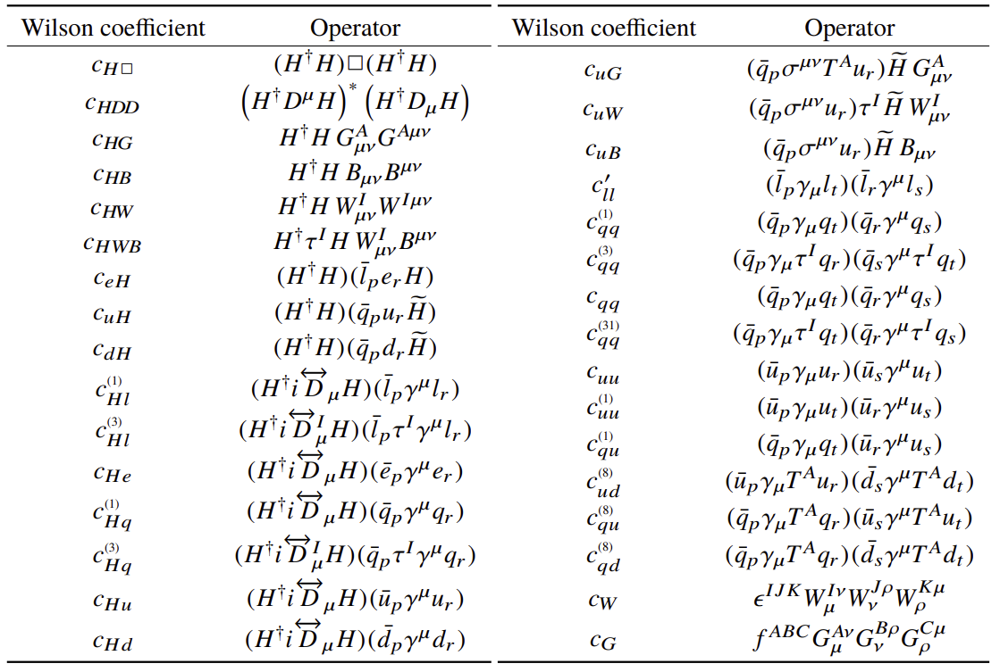

# [ATLAS-CONF-2020-053](http://cdsweb.cern.ch/record/2743067)
## Interpretations of the combined measurement of Higgs boson production and decay

### Model details

|                        |                     |
|------------------------|---------------------|
| Model                  | SMEFT               |
| Flavour Symmetry       | $U(3)^5$            |
| Input Parameter Scheme | $\{m_W, m_Z, G_F\}$ |

### Wilson Coefficients

### Derivation details

| Process           | Equation derivation method                     |
|-------------------|------------------------------------------------|
| ggH               | SMEFTatNLO                                     |
| qqH               | SMEFTsim                                       |
| WH_lep            | SMEFTsim                                       |
| ZH_lep            | SMEFTsim                                       |
| ggZH              | SMEFTatNLO                                     |
| ttH               | SMEFTsim                                       |
| tH                | SMEFTsim                                       |
|                   |                                                |
| $H\rightarrow gg$           | SMEFTatNLO                                     |
| $H\rightarrow\gamma\gamma$ | [Analytical](https://arxiv.org/abs/1807.11504) |
| Other decay modes | SMEFTsim                                       |
| Total | Uncertain

### Notes on acceptance
Considered only for $H\rightarrow 4l$. Corrected derived [here](https://arxiv.org/abs/2004.03447).